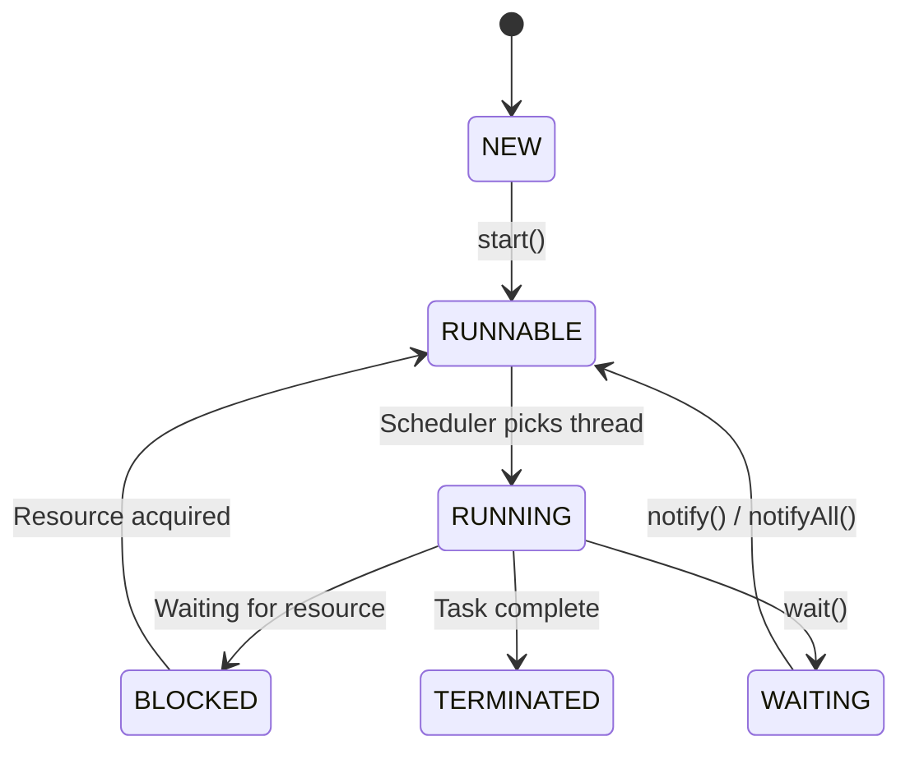
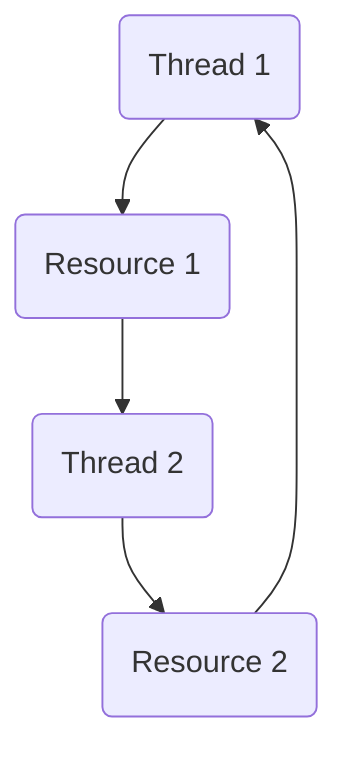

# Java Threads and Synchronization

## States of a Thread

```java
World t1 = new World(); // NEW state
t1.start();             // RUNNABLE state
// After start(), it may enter RUNNING state
// BLOCKED when waiting for a resource
// TERMINATED when the task is completed
```

**Note:**
- Implement `Runnable` when you need multiple inheritance.

### Thread State Diagram


---

## Common Thread Methods

- `sleep()` – Pause the thread for a specified time.
- `run()` – Contains the code executed when the thread starts.
- `start()` – Starts the thread and calls `run()` internally.
- `join()` – Wait for a thread to finish execution.
- `setPriority()` – Hint to JVM to set thread priority.
- Naming the thread – Create a constructor for the `Thread` class with a name.
- `interrupted()` – Interrupts the thread.
- `yield()` – Hint to scheduler to give other threads a chance.
- `setDaemon()` – Makes a thread a **Daemon Thread**.

---

## Synchronization

- **Synchronized block** ensures **mutual exclusion** – two threads cannot access the same critical resource simultaneously.

### Lock Types

#### 1. Intrinsic Lock
- Built into every Java object.
- Automatically used with the `synchronized` keyword.

#### 2. Explicit Lock
- Provided in `java.util.concurrent.locks`.
- Control when to apply/release a lock.

Example:
```java
Lock lock = new ReentrantLock();
lock.lock();
lock.tryLock();
lock.unlock();
lock.lockInterruptibly();
```

- **ReentrantLock** helps in **deadlock prevention**.
- Fairness: `new ReentrantLock(true)` ensures no starvation.

---

## Disadvantages of `synchronized`

- No fairness guarantee.
- Blocking.
- No interruptibility.
- No read/write differentiation.

---

## ReadWriteLock

- Allows **multiple threads to read concurrently** when no one is writing.
- Ensures **exclusive locking** for writes.

---

## Deadlock

Four conditions for deadlock:
1. Mutual Exclusion
2. Hold and Wait
3. No Preemption
4. Circular Wait

### Deadlock Diagram


---

## Thread Communication

- `wait()` – Current thread releases lock and waits.
- `notify()` – Wakes up one waiting thread.
- `notifyAll()` – Wakes up all waiting threads.

---

## Thread Safety

- Ensures multiple threads can safely access shared resources without race conditions.
