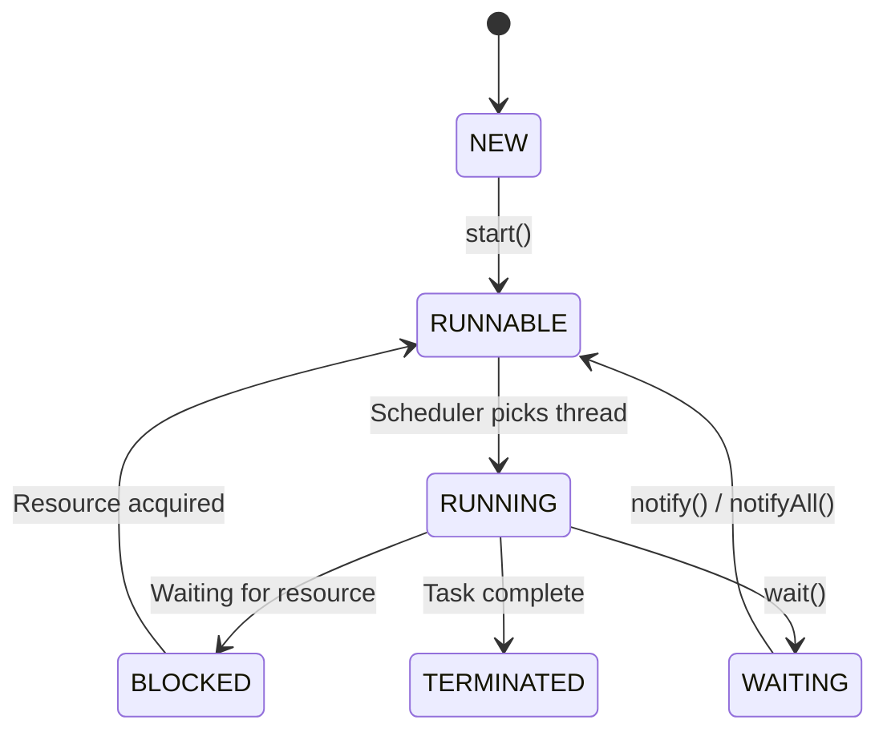
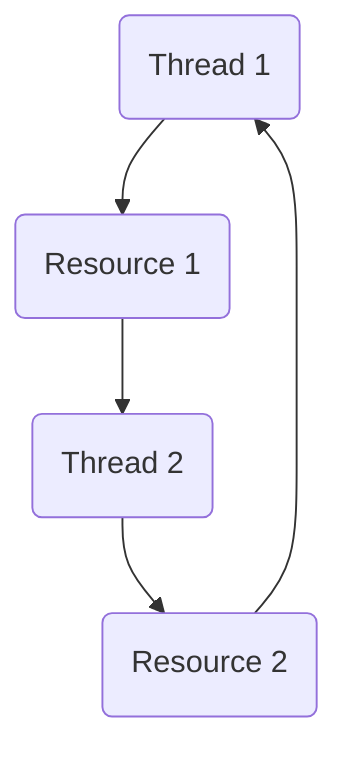
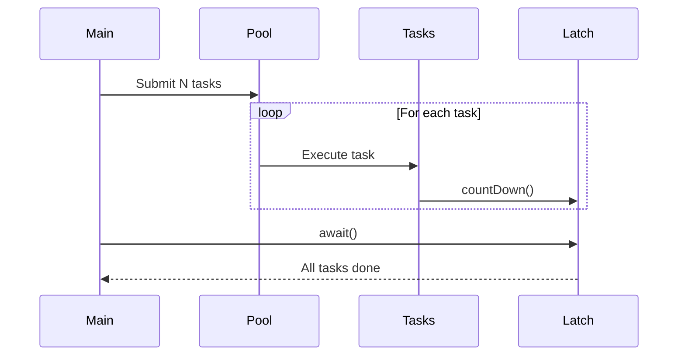

# Java Threads, Synchronization, and Concurrency Utilities

## 📌 States of a Thread

```java
World t1 = new World(); // NEW state
t1.start();             // RUNNABLE state
// After start(), it may enter RUNNING state
// BLOCKED when waiting for a resource
// TERMINATED when the task is completed
```

**Note:**
- Implement `Runnable` when you need multiple inheritance.

### 🧩 Thread State Diagram


---

## 🛠 Common Thread Methods

- `sleep()` – Pause the thread for a specified time.
- `run()` – Contains the code executed when the thread starts.
- `start()` – Starts the thread and calls `run()` internally.
- `join()` – Wait for a thread to finish execution.
- `setPriority()` – Hint to JVM to set thread priority.
- `interrupted()` – Interrupts the thread.
- `yield()` – Hint to scheduler to give other threads a chance.
- `setDaemon()` – Makes a thread a **Daemon Thread**.

---

## 🔒 Synchronization

- **Synchronized block** ensures **mutual exclusion** – two threads cannot access the same critical resource simultaneously.

### Lock Types

#### 1️⃣ Intrinsic Lock
- Built into every Java object.
- Automatically used with the `synchronized` keyword.

#### 2️⃣ Explicit Lock
- Provided in `java.util.concurrent.locks`.
- Control when to apply/release a lock.

```java
Lock lock = new ReentrantLock();
lock.lock();
lock.tryLock();
lock.unlock();
lock.lockInterruptibly();
```

- **ReentrantLock** helps in **deadlock prevention**.
- Fairness: `new ReentrantLock(true)` ensures no starvation.

---

## ❌ Disadvantages of `synchronized`
- No fairness guarantee.
- Blocking.
- No interruptibility.
- No read/write differentiation.

---

## 📖 ReadWriteLock

- Allows **multiple threads to read concurrently** when no one is writing.
- Ensures **exclusive locking** for writes.

---

## 💀 Deadlock

Four conditions for deadlock:
1. Mutual Exclusion
2. Hold and Wait
3. No Preemption
4. Circular Wait

### Deadlock Diagram


---

## 📢 Thread Communication

- `wait()` – Current thread releases lock and waits.
- `notify()` – Wakes up one waiting thread.
- `notifyAll()` – Wakes up all waiting threads.

---

## 🛡 Thread Safety
Ensures multiple threads can safely access shared resources without race conditions.

---

## ⚡ Lambda Expressions in Java

- **Runnable** is a **functional interface**.
- **Functional Interface**: Has only one abstract method.
- **Lambda Expression**: Anonymous function to implement a functional interface.

### Example
```java
Runnable task = () -> System.out.println("Thread is running...");
new Thread(task).start();
```

---

## 🧵 Thread Pools

**Advantages:**
1. Resource management
2. Reduced response time
3. Control over thread count

**Problems with manual threads:**
- Scalability issues
- Thread reuse difficulty
- Error handling complexity

---

## 🚀 Executor Framework

Introduced in Java 5 (`java.util.concurrent`) to simplify concurrent programming.

**Key Interfaces:**
- `Executor`
- `ExecutorService`
- `ScheduledExecutorService`

### Example
```java
public class ExecutorExample {
    public static void main(String[] args) {
        ExecutorService executorService = Executors.newFixedThreadPool(3);
        long startTime = System.currentTimeMillis();

        for (int i = 0; i < 10; i++) {
            int finalI = i;
            executorService.submit(() -> {
                try {
                    Thread.sleep(1000);
                } catch (InterruptedException e) {
                    Thread.currentThread().interrupt();
                }
                System.out.println(finalI);
            });
        }

        executorService.shutdown();
        try {
            executorService.awaitTermination(10, TimeUnit.SECONDS);
        } catch (InterruptedException e) {
            Thread.currentThread().interrupt();
        }

        System.out.println("Execution time: " + (System.currentTimeMillis() - startTime) + "ms");
    }
}
```

---

## 📏 Runnable vs Callable

| Feature        | Runnable | Callable |
|---------------|----------|----------|
| Return value  | ❌ No    | ✅ Yes  |
| Exception     | Cannot throw checked exceptions | Can throw checked exceptions |
| Method        | `run()` | `call()` |

---

## 🕒 ScheduledExecutorService

- Schedule tasks to run at a fixed rate or with a delay.

```java
ScheduledExecutorService scheduler = Executors.newScheduledThreadPool(1);

scheduler.scheduleAtFixedRate(
    () -> System.out.println("Task executed"), 
    0, 2, TimeUnit.SECONDS
);
```

---

## ⏳ CountDownLatch with ExecutorService

`CountDownLatch` lets one or more threads wait until a set of tasks complete.

**Key methods:**
- `countDown()` → Decrements latch count.
- `await()` → Wait until count reaches zero.

### Example
```java
import java.util.concurrent.*;

public class LatchWithExecutor {
    public static void main(String[] args) throws InterruptedException {
        int tasks = 5;
        CountDownLatch latch = new CountDownLatch(tasks);
        ExecutorService pool = Executors.newFixedThreadPool(3);

        for (int i = 1; i <= tasks; i++) {
            final int taskId = i;
            pool.submit(() -> {
                try {
                    System.out.println("Task " + taskId + " started");
                    Thread.sleep(500 + taskId * 100L);
                    System.out.println("Task " + taskId + " finished");
                } catch (InterruptedException e) {
                    Thread.currentThread().interrupt();
                } finally {
                    latch.countDown();
                }
            });
        }

        latch.await(); // Wait for all tasks
        System.out.println("All tasks completed");
        pool.shutdown();
    }
}
```

### Diagram


**Best Practices:**
- Always call `countDown()` in `finally` block.
- Use `await(timeout)` to avoid infinite blocking.

---

## 🔮 CompletableFuture
Introduced in Java 8 for **asynchronous programming**.

```java
CompletableFuture.supplyAsync(() -> "Hello")
    .thenApply(s -> s + " World")
    .thenAccept(System.out::println);
```

---
