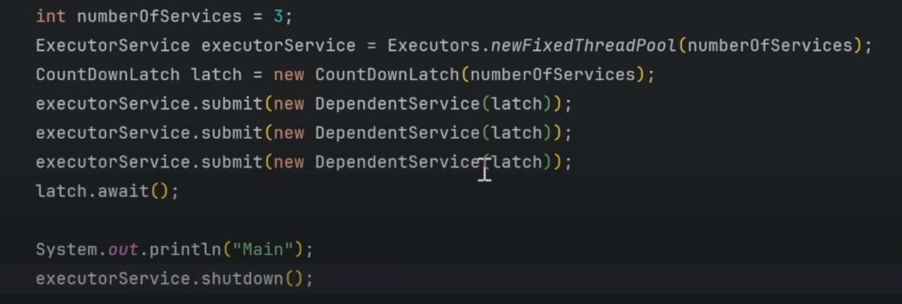

# Java Threads and Synchronization

## States of a Thread

```java
World t1 = new World(); // NEW state
t1.start();             // RUNNABLE state
// After start(), it may enter RUNNING state
// BLOCKED when waiting for a resource
// TERMINATED when the task is completed
```

**Note:**
- Implement `Runnable` when you need multiple inheritance.

### Thread State Diagram


---

## Common Thread Methods

- `sleep()` – Pause the thread for a specified time.
- `run()` – Contains the code executed when the thread starts.
- `start()` – Starts the thread and calls `run()` internally.
- `join()` – Wait for a thread to finish execution.
- `setPriority()` – Hint to JVM to set thread priority.
- Naming the thread – Create a constructor for the `Thread` class with a name.
- `interrupted()` – Interrupts the thread.
- `yield()` – Hint to scheduler to give other threads a chance.
- `setDaemon()` – Makes a thread a **Daemon Thread**.

---

## Synchronization

- **Synchronized block** ensures **mutual exclusion** – two threads cannot access the same critical resource simultaneously.

### Lock Types

#### 1. Intrinsic Lock
- Built into every Java object.
- Automatically used with the `synchronized` keyword.

#### 2. Explicit Lock
- Provided in `java.util.concurrent.locks`.
- Control when to apply/release a lock.

Example:
```java
Lock lock = new ReentrantLock();
lock.lock();
lock.tryLock();
lock.unlock();
lock.lockInterruptibly();
```

- **ReentrantLock** helps in **deadlock prevention**.
- Fairness: `new ReentrantLock(true)` ensures no starvation.

---

## Disadvantages of `synchronized`

- No fairness guarantee.
- Blocking.
- No interruptibility.
- No read/write differentiation.

---

## ReadWriteLock

- Allows **multiple threads to read concurrently** when no one is writing.
- Ensures **exclusive locking** for writes.

---

## Deadlock

Four conditions for deadlock:
1. Mutual Exclusion
2. Hold and Wait
3. No Preemption
4. Circular Wait

### Deadlock Diagram


---

## Thread Communication

- `wait()` – Current thread releases lock and waits.
- `notify()` – Wakes up one waiting thread.
- `notifyAll()` – Wakes up all waiting threads.

---

## Thread Safety

- Ensures multiple threads can safely access shared resources without race conditions.

## Lambda Expressions in Java

- **Runnable** is a **functional interface**.
- **Functional Interface**: An interface that has **only one abstract method**.
- **Lambda Expression**: An anonymous function (a function without a name) that can be used to implement a functional interface.

### Example
```java
// Using Lambda Expression with Runnable
Runnable task = () -> {
    System.out.println("Thread is running...");
};
new Thread(task).start();

## Thread Pools
1.Resource management
2. Response time decrease
3. Control over Thread Counter

Problems with existing Thread creation and management
Manual thread management
Scalability
Thread Reuse
Error Handling


Executor Framework
introduced in java 5 as part of the java.util concurrent.package to simplify the development of concurrent applications by abstracting away many of complexities involved in creating and managing thread
We'll be writing business logic executor will handle threading

Executor
ExecutorService
SchedulerExecutorService

Example of executor
public class ExecutorExample {
    public static void main(String[] args) {

        ExecutorService executorService = Executors.newFixedThreadPool(9);
        long startTime = System.currentTimeMillis();
        for(int i=0;i<10;i++){
            int finalI = i;
            executorService.submit(() ->{
                try {
                    Thread.sleep(1000);
                } catch (InterruptedException e) {
                    throw new RuntimeException(e);
                }
                System.out.println(finalI);
            });

        }

        executorService.shutdown();
        try {
            executorService.awaitTermination(10000, TimeUnit.MILLISECONDS);
        } catch (InterruptedException e) {
            throw new RuntimeException(e);
        }
        System.out.println("Time");
        System.out.println(System.currentTimeMillis()-startTime);

    }
}

.invokeAll() execute the list of callables and return futures and result when all completed.
.invokeAll() blocks the main thread till all threads are completed
.invokeAny() execute the given tasks and return result directly and skip all other tasks


Difference between runnable and callable
we can return something throw callable interface
Callable also throws exceotion
in runnable we use run()
in callable we use call()

Future<String> future when we use .submit() then we can return something and store that in Future


methods in Future
f.get()
f.isDone()
f.cancel()
f.isCancel() 

ScheduledExecutor
task can be scheduled as well as we can also have the time period
add code

.scheduleAtFixedRate()
.scheduleAtWithDelay()

It returns ScheduledFuture


Executors.newCachedThreadPool()  makes a thread pool and terminate the thread after 60 sec of inactivity we can have many thread pools

CountDownLatch
when we want to wait for completion of 1 or more threads




 
